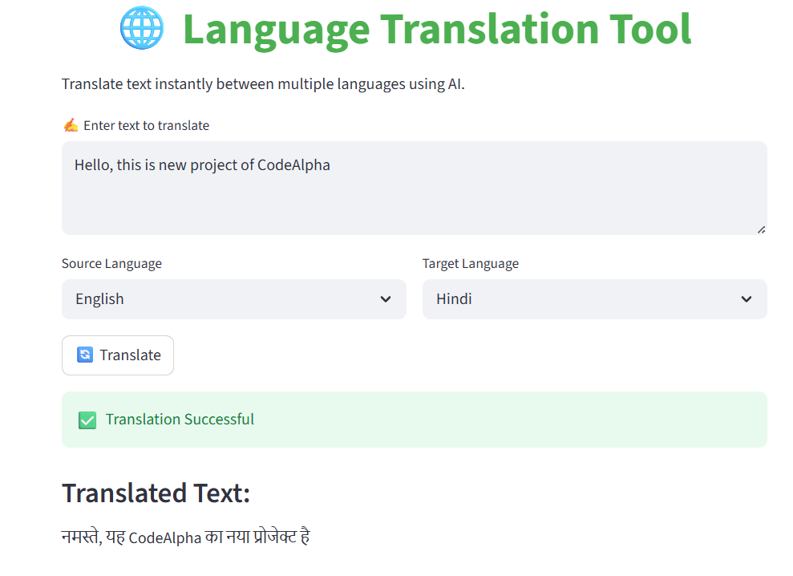
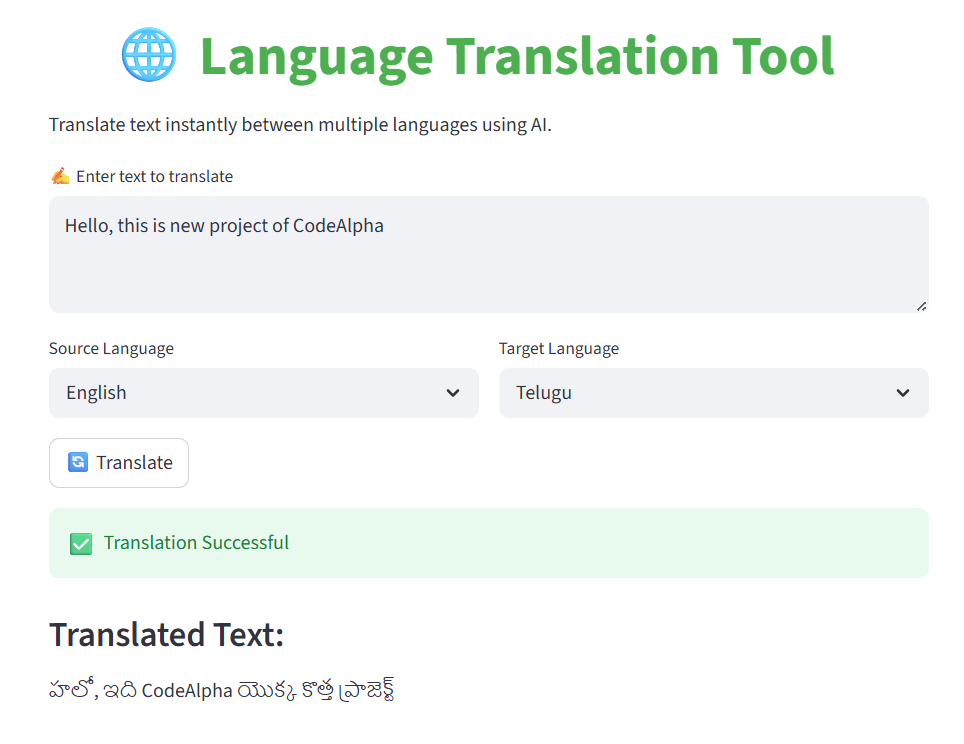

# 🌐 AI Language Translation Tool

This project is a Language Translation Tool that leverages Artificial Intelligence and Python and Streamlit.

## 🔄 Features
- Translate text to other languages
It offers a straightforward and easy-to-use interface.It comes with a simple and easy to use interface.
- Fast AI-based translation
- Supports English, Hindi, French, Spanish, German, Telugu, Japanese and Chinese

## 🛠 Technologies Used
- Python
- Streamlit
- Deep Translator

## Screenshots
### Home Page


### Translation Output

## ▶ How to Run the Project

1. Install required libraries:
```bash
pip install -r requirements.txt
```

2. Run the application:
```bash
python -m streamlit run app.py
```

